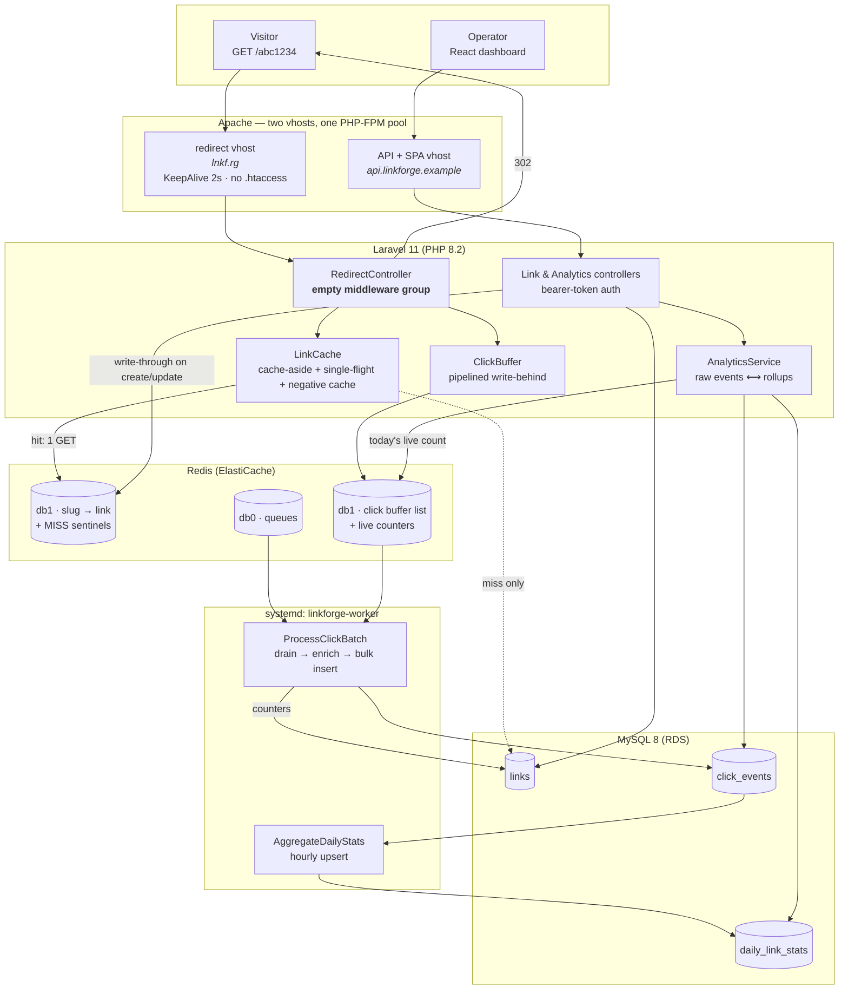
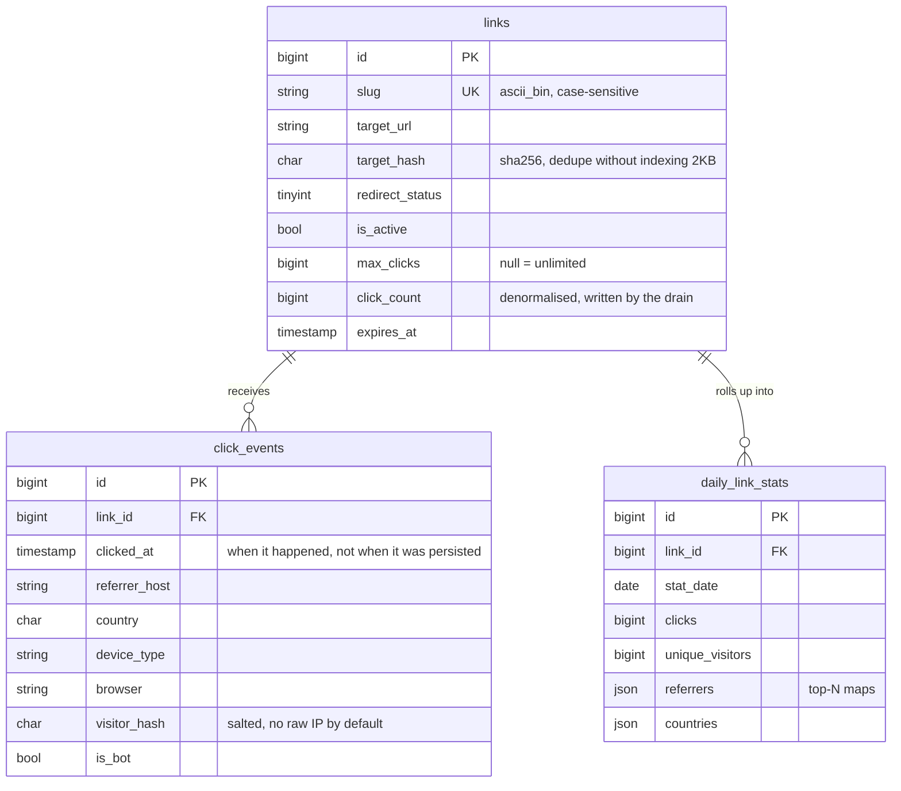

# LinkForge — High-Throughput URL Shortener (LAMP)

LinkForge is a URL shortener built on a classic **LAMP** stack — **A**pache,
**M**ySQL, **P**HP 8.2 / Laravel 11 on **L**inux (Amazon Linux 2023) — with
**Redis** in front of the redirect path and a **React + TypeScript** analytics
dashboard on top.

The whole design follows from one constraint:

> **A redirect is one Redis `GET` and one `302`.** No session, no CSRF, no
> MySQL, no synchronous write — even though every redirect is also a tracked
> analytics event.

Getting both of those at once is the interesting part. Clicks are written
**behind** the response into a Redis buffer that a queue worker drains into
MySQL in batches, so the tracking never appears in the user's latency.

---

## Contents

- [Architecture](#architecture)
- [The redirect hot path](#the-redirect-hot-path)
- [Click tracking without blocking](#click-tracking-without-blocking)
- [Analytics](#analytics)
- [Data model](#data-model)
- [API reference](#api-reference)
- [Dashboard](#dashboard)
- [Running it](#running-it)
- [Testing it](#testing-it)
- [Deployment](#deployment)
- [Project layout](#project-layout)

---

## Architecture



**Read the diagram by line weight:** the solid path `visitor → Apache →
RedirectController → Redis → 302` is what runs on every request. The dotted
`LinkCache ⇢ links` edge fires only on a cache miss. Everything below the
worker box happens off the request entirely.

---

## The redirect hot path

`GET /{slug}` is routed through a middleware group with **nothing in it** —
sessions, cookie encryption and CSRF cost milliseconds and buy nothing for an
anonymous redirect. The route regex `[A-Za-z0-9]{1,32}` rejects malformed slugs
before any Redis call happens.

`LinkCache::resolve()` is cache-aside with four properties that matter at scale:

| Behaviour | Why it's there |
|---|---|
| **Hit = one Redis `GET`** | the cached payload is a compact positional array (id, slug, target, status, active, expiry, cap) — a few dozen bytes, no Eloquent hydration |
| **Negative caching** | an unknown slug stores a `MISS` sentinel for 60s. Without it, a scanner walking the slug space turns every 404 into a MySQL query — the classic way a shortener falls over |
| **Single-flight lock** | on a cold-but-popular slug, one request rebuilds the entry and the rest briefly poll the cache instead of stampeding MySQL with N identical reads |
| **TTL jitter** | entries written in the same burst get `ttl + rand(0, jitter)` so they do not all expire in the same second |

Redis being unreachable is handled, not fatal: `LinkCache` catches it, logs, and
reads straight from MySQL. Redirects get slower; they do not break.

Links are checked against three conditions before redirecting — disabled,
expired, click cap reached — and a link that fails one returns **410 Gone**
rather than 404, because "existed and stopped" is different from "never
existed". The cap is evaluated against the **live Redis counter**, so a capped
link stops the moment it hits its limit rather than after the next drain.

The default status is **302, not 301**. A 301 is cached by browsers
indefinitely, which silently ends click tracking and makes the link impossible
to re-target. `Cache-Control: private, no-store` is set to match.

---

## Click tracking without blocking

```
request  ──►  RPUSH buffer + INCR total + INCR day + INCR global   (1 pipelined round-trip)
                                    │
worker   ◄──────────── LRANGE + LTRIM (one MULTI) ─────────────────┘
             │
             ├─ enrich: UA → device/browser/os, referrer → host, edge header → country
             ├─ bulk INSERT into click_events, 500 rows per statement
             └─ one UPDATE per link for the denormalised counters
```

The request captures only cheap header reads. All parsing is deferred to the
worker. At 5,000 clicks/second that is ~10 multi-row inserts per second instead
of 5,000 single-row transactions.

The drain is deliberately **at-most-once**: `LRANGE` + `LTRIM` in one
transaction means a worker crash mid-batch loses that batch. For click
telemetry that is the right trade — the alternative risks double-counting, and
the Redis counters remain authoritative for live totals either way.

Two safety valves: the buffer is trimmed if it exceeds `max_buffer` (so a dead
worker cannot push Redis to `maxmemory` and start evicting the *link cache*),
and a buffer write that fails is logged and swallowed — losing a click beats
failing a redirect.

Privacy: raw IPs are **not** stored by default. A salted hash is kept instead,
which still supports unique-visitor counts.

---

## Analytics

`AnalyticsService` picks its source by range length:

- **≤ 14 days** → scan `click_events` directly (full fidelity, hour buckets available)
- **> 14 days** → read `daily_link_stats`, pre-aggregated per link per day

Either way, the **live Redis counters are overlaid onto today's bucket**, so the
dashboard is correct to the second even though persistence is asynchronous.

`AggregateDailyStats` recomputes and upserts each `(link_id, stat_date)` pair,
so it is idempotent — re-running for a day converges instead of double-counting.
It runs hourly over the trailing two days, which covers drains that land after
midnight.

Series are zero-filled, so a chart draws a continuous line rather than
collapsing days with no traffic.

---

## Data model



`click_events` carries exactly two secondary indexes — `(link_id, clicked_at)`
and `(clicked_at)` — because those are the only two shapes analytics ever asks
for. Indexing `referrer_host`/`country`/`device_type` would add four index
writes to the hot insert path for no read benefit; they are only ever filtered
inside an already-narrow time window. See `deploy/mysql/tuning.md`.

Slugs come from one of two strategies, configurable:

- **`random`** (default) — drawn from an alphabet with `0/O/1/l/I` removed, so a
  slug read aloud or off a printed page is unambiguous. Retries on collision and
  widens after repeated ones.
- **`counter`** — a Redis `INCR` base62-encoded. No collisions by construction,
  dense slug space, and the digit-first alphabet makes encodings sort in the
  same order as their ids, so MySQL index inserts stay append-only.

Deleted links are soft-deleted and their **slugs are never reissued** — printed
links and QR codes already point at them.

---

## API reference

All endpoints require `Authorization: Bearer <token>`; tokens are stored as
SHA-256 hashes, carry abilities, and are rate limited per minute.

| Method | Path | Ability | Description |
|---|---|---|---|
| `GET` | `/api/health` | — | Redis + MySQL probes, click buffer depth |
| `GET` | `/api/links` | `links:read` | paginated, `?q=`, `?sort=`, `?direction=` |
| `POST` | `/api/links` | `links:write` | create; optional `alias` |
| `POST` | `/api/links/bulk` | `links:write` | up to 100 at once |
| `GET` | `/api/links/{id}` | `links:read` | one link, with live click count |
| `PATCH` | `/api/links/{id}` | `links:write` | re-target, rename, enable/disable |
| `DELETE` | `/api/links/{id}` | `links:write` | soft delete + cache eviction |
| `GET` | `/api/analytics/summary` | `analytics:read` | KPIs with period-over-period delta |
| `GET` | `/api/analytics/timeseries` | `analytics:read` | `?days=`, `?granularity=hour\|day` |
| `GET` | `/api/analytics/top-links` | `analytics:read` | ranked by clicks in range |
| `GET` | `/api/analytics/breakdown/{dim}` | `analytics:read` | `referrer`, `country`, `device`, `browser`, `os` |
| `GET` | `/api/analytics/links/{id}` | `analytics:read` | everything the detail page needs |

```bash
curl -X POST https://api.linkforge.example/api/links \
  -H "Authorization: Bearer $LINKFORGE_TOKEN" \
  -H 'Content-Type: application/json' \
  -d '{"target_url":"https://example.com/launch","alias":"launch26","title":"Launch"}'
```

Destinations are validated on the way in: scheme allow-list (`http`/`https`
only), length cap, and a block on loopback, private, link-local and
`.internal`/`.local` hosts — a shortener is an open redirector by design, and
without this it is a convenient way to make someone else's browser fetch
`169.254.169.254`.

---

## Dashboard

`dashboard/` is a Vite + React + TypeScript SPA served by the API vhost under
`/dashboard`.

- **Overview** — KPI tiles (clicks with period-over-period delta, unique
  visitors, active links, buffer depth), the click time series with a
  1d/7d/30d/90d/1y range selector, top links, and referrer / country / device /
  browser breakdowns.
- **Links** — create with server-side validation surfaced per field, search,
  sortable columns, copy-to-clipboard, enable/disable, delete.
- **Link detail** — that link's own series and breakdowns.

Chart choices worth noting: the time series is a single series, so it carries no
legend (the card title names it) and the fill exists to give the line weight
rather than to encode anything. Top links are horizontal bars because slugs read
far better on the y-axis than rotated under columns. Breakdowns are ranked share
lists rather than pies — comparing bar lengths beats comparing arc angles — with
the tail folded into a single "Other" row. Colours are CSS custom properties
declared for light and dark under both `prefers-color-scheme` and a
`data-theme` scope, so the in-app toggle wins in either direction.

Polling refreshes data in place without flashing skeletons, and every request is
aborted when its inputs change so a fast range toggle can't be overwritten by a
slower earlier response.

---

## Running it

### Requirements

PHP 8.2+ (`pdo_mysql`, `redis`), Composer, MySQL 8, Redis 6+, Node 18+.

### Local

```bash
# 1. Application
composer install
cp .env.example .env
php artisan key:generate

# point .env at your local MySQL + Redis, then
php artisan migrate
php artisan db:seed            # 45 days of demo traffic across 12 links
php artisan linkforge:token dashboard   # copy the printed token

php artisan serve              # http://127.0.0.1:8000

# 2. Worker (separate terminal) — drains clicks into MySQL
php artisan queue:work redis --queue=clicks,default --sleep=1

# 3. Dashboard (separate terminal)
cd dashboard
npm install
cp .env.example .env
npm run dev                    # http://127.0.0.1:5173 — paste the token
```

Then try it:

```bash
curl -X POST http://127.0.0.1:8000/api/links \
  -H "Authorization: Bearer $TOKEN" -H 'Content-Type: application/json' \
  -d '{"target_url":"https://example.com/hello"}'

curl -i http://127.0.0.1:8000/<slug>          # 302, and a buffered click
curl -s http://127.0.0.1:8000/api/health      # click_buffer_depth: 1
php artisan linkforge:drain-clicks            # → click_events, depth back to 0
```

### Useful commands

| Command | What it does |
|---|---|
| `linkforge:drain-clicks [--loop]` | drain the Redis click buffer into MySQL |
| `linkforge:rollup --days=N` | recompute the daily rollups |
| `linkforge:warm-cache --limit=N` | preload the hottest links into Redis |
| `linkforge:token <name>` | issue an API token |

---

## Testing it

```bash
composer test           # or: php artisan test
php artisan test --testsuite=Unit
php artisan test --filter=RedirectTest
```

Tests run against **in-memory SQLite with no Redis server**: because every
hot-path Redis call is funnelled through `RedisLinkStore`, the suite binds an
in-memory double (`tests/Support/FakeLinkStore`) in its place and exercises the
real controllers, cache and drain end to end.

What's covered:

| Suite | Asserts |
|---|---|
| `Unit/Base62Test` | round-trips, ordering preservation for counter slugs, ambiguous characters absent from random slugs |
| `Unit/UserAgentParserTest` | device/browser/OS classification, Edge-vs-Chrome ordering, bot detection |
| `Unit/LinkCacheTest` | **a cache hit issues zero SQL**, unknown slugs are negatively cached and the repeat lookup issues zero SQL, invalidation, warming |
| `Feature/RedirectTest` | 302/301 semantics and cache headers, 410 for disabled/expired/capped, **the click is buffered and absent from MySQL until the drain**, enrichment correctness, no raw IP stored |
| `Feature/LinkApiTest` | token auth + abilities, alias rules, unsafe-target rejection (`javascript:`, metadata IP, private ranges), write-through and eviction on update/delete, bulk create |
| `Feature/AnalyticsApiTest` | period-over-period deltas, zero-filled series, hourly granularity, ranked top links, breakdown shares, **rollup idempotency**, long ranges served from the rollup table |

Dashboard checks:

```bash
cd dashboard
npm run typecheck
npm run lint
```

Load testing the redirect path (warm / cold / miss, measured separately):

```bash
SLUG=abc1234 REQUESTS=50000 CONCURRENCY=200 bash deploy/bench.sh
```

---

## Deployment

Full walkthrough in **[`deploy/README.md`](deploy/README.md)**; MySQL sizing and
index rationale in [`deploy/mysql/tuning.md`](deploy/mysql/tuning.md).

```bash
sudo bash deploy/bootstrap-al2023.sh
```

installs Apache + php-fpm, tunes OPcache (`validate_timestamps=0`, JIT) and a
static fpm pool, drops in both vhosts, and enables `linkforge-worker.service`
and `linkforge-scheduler.timer`.

The one operational number to watch is **`click_buffer_depth`** from
`/api/health`: steady state is near zero, and a rising depth means the worker is
down or MySQL is slow. Redirects are unaffected either way.

---

## Project layout

```
app/
  Http/Controllers/    RedirectController (hot path), Link, Analytics, Health
  Http/Middleware/     ApiTokenAuth
  Http/Requests/       Store/Update/BulkStore link validation
  Services/            LinkCache · ClickBuffer · RedisLinkStore · SlugGenerator
                       AnalyticsService · LinkService · UserAgentParser
                       GeoResolver · TargetUrlValidator
  Jobs/                ProcessClickBatch · AggregateDailyStats
  Console/Commands/    drain-clicks · rollup · warm-cache · token
  Support/             Base62 · ResolvedLink · ClickRecord
config/linkforge.php   every tuning knob: slug, cache, buffer, analytics
database/migrations/   links · click_events · daily_link_stats · api_tokens
dashboard/             React + TypeScript analytics SPA
deploy/                Apache vhosts · systemd units · bootstrap · bench · MySQL notes
tests/                 Unit + Feature (SQLite + in-memory Redis double)
```
